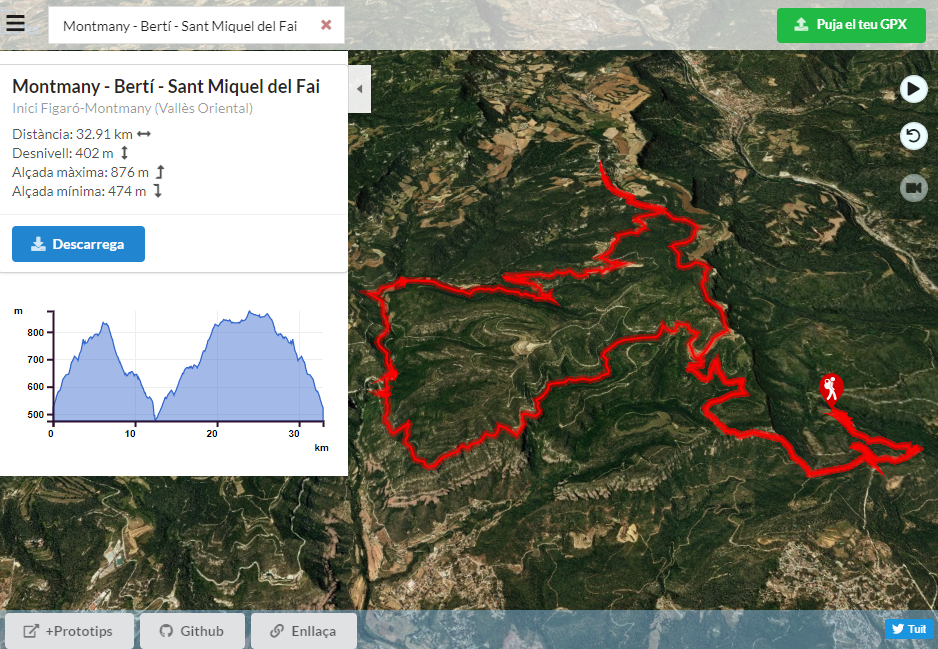

# Rutes 3D Catalunya


## Instal.lació

 Copiar en un directori web tot el directori **/dist** i els arxius **index.html**  i **rutes-catalunya.png**.


## Demo

https://betaserver.icgc.cat/rutes-catalunya


### Clonar

```
 git clone http://172.17.28.68/geostarters/rutes-catalunya.git

 cd rutes-catalunya
 npm install
 npm run start
```


